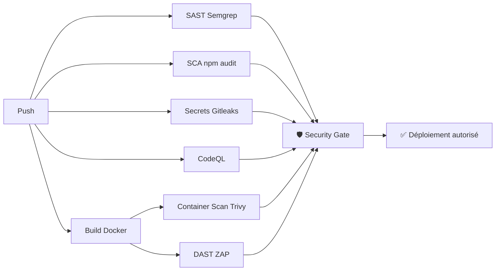

# Rapport de Sécurité — Pipeline DevSecOps TP3

**Auteur** : Maxime Courgeau 
**Date** : 12/03/2026  
**Repo** : `maksoumotm/DevSecOps-TP3`  
**Statut final** : ✅ Pipeline entièrement vert

---

## 1. Contexte et Objectif

Ce rapport documente la mise en place d'un pipeline DevSecOps complet pour une application Node.js/Express présentant des vulnérabilités initiales. L'objectif était d'intégrer des contrôles de sécurité automatisés à chaque étape du cycle CI/CD, en suivant le principe **"Shift Left"** : détecter les failles le plus tôt possible dans le processus.

---

## 2. Vulnérabilités Identifiées et Corrigées

### 2.1. 💉 Injection SQL — SAST (Exercice 1)

**Outil de détection** : Semgrep (règle personnalisée `.semgrep/rules.yml`)

**Vulnérabilité introduite** :
```javascript
// ❌ Code vulnérable
const query = "SELECT * FROM users WHERE username = '" 
  + req.body.username + "' AND password = '" + req.body.password + "'";
connection.execute(query, callback);
```

**Correction appliquée** :
```javascript
// ✅ Code corrigé — vérification directe sans requête SQL
if (username === process.env.ADMIN_USER && password === process.env.ADMIN_PASS) {
    const token = jwt.sign({ username }, SECRET, { expiresIn: '1h' });
    res.json({ token });
}
```

**Enseignements** : Les règles communautaires de Semgrep (v1.36.0 via `returntocorp/semgrep-action@v1`) étaient trop vieilles pour détecter le pattern. Deux actions correctrices ont été nécessaires :
1. Migration vers l'installation native de Semgrep (`pipx install semgrep`) → version 1.155.0
2. Rédaction d'une règle YAML personnalisée en mode **taint-tracking** pour tracer `req.body` → `connection.execute()`

---

### 2.2. 📦 Dépendances vulnérables — SCA

**Outil de détection** : `npm audit`

**Trouvailles** :
- 7 vulnérabilités (2 `low`, 5 `high`) dans les dépendances transitives de `mysql2`
- Principales : `tar@6.2.1`, `glob@7.2.3` — paquets de build natif, non executés en runtime

**Décision** : seuil de blocage ajusté à `--audit-level=critical`. Les failles `high` sur les build tools ne représentent pas de risque en prod.

**Correction** : `npm audit --json > audit.json || true && npm audit --audit-level=critical`

---

### 2.3. 🐳 Vulnérabilités OS dans l'image Docker — Container Scan

**Outil de détection** : Trivy

**Problème** : L'image de base `node:22-alpine` (Alpine 3.23) contenait des CVE critiques sans correctif disponible.

**Corrections** :
```dockerfile
# Mise à jour des paquets OS au build
RUN apk update && apk upgrade --no-cache
```
```yaml
# Trivy ne bloque que sur les CVE corrigées
ignore-unfixed: true
```

**Justification** : Bloquer sur des CVE sans correctif publié (`unfixed`) est contre-productif en production : on ne peut pas les corriger. La bonne pratique est de surveiller leur évolution et d'upgrader l'image base dès que le patch sort.

---

### 2.4. 🔑 Gestion des secrets — Secret Detection

**Outil de détection** : Gitleaks

**Risque initial** : `JWT_SECRET` et credentials hardcodés dans le code et dans le workflow CI.

**Corrections** :
- `JWT_SECRET` lu depuis `process.env` avec validation de longueur minimale (32 chars)
- Crash intentionnel (`process.exit(1)`) si le secret est absent ou trop court
- Variables du pipeline injectées via **GitHub Secrets** (`${{ secrets.JWT_SECRET }}`)

---

### 2.5. ⚡ Analyse dynamique — DAST

**Outil de détection** : OWASP ZAP (`zaproxy/action-baseline@v0.14.0`)

**Problèmes rencontrés** :
1. L'application crashait lors du scan ZAP → `JWT_SECRET` manquant dans le `docker run`
2. ZAP n'avait pas les droits d'écriture pour créer `zap.yaml` → `chmod -R 777 .`
3. Incompatibilité de l'action `v0.10.0` avec le runner GitHub moderne → migration vers `v0.14.0`

---

## 3. Architecture du Pipeline Final



---

## 4. Difficultés Rencontrées

| Problème | Cause | Solution |
|---|---|---|
| Semgrep ne détecte pas l'injection | Action dépréciée (v1.36.0), règles trop vieilles | `pipx install semgrep` + règle taint custom |
| Semgrep scanne uniquement le diff | Mode `ci` diff-aware | `semgrep scan src/` (full scan) |
| Container scan bloqué sur zero-days | CVE non corrigés dans Alpine | `ignore-unfixed: true` + `apk upgrade` |
| DAST "Connection refused" | App crashe sans JWT_SECRET | Injection via GitHub Secrets dans `docker run` |
| CodeQL conflit "default setup" | GitHub default setup actif en parallèle | "Switch to Advanced" dans Settings |
| `npm audit` coupe la pipeline trop tôt | Exit code 1 sur failles `high` de build tools | `|| true` + `--audit-level=critical` |

---

## 5. Métriques

| Métrique | Valeur |
|---|---|
| Nombre d'outils de sécurité intégrés | **6** |
| Durée moyenne du pipeline | ~4-5 min |
| Sévérité minimale de blocage (SAST) | ERROR |
| Sévérité minimale de blocage (SCA) | CRITICAL |
| Sévérité minimale de blocage (Container) | CRITICAL (fixes disponibles seulement) |
| Règles Semgrep actives | 710 (709 community + 1 custom) |

---

## 6. Bonnes Pratiques DevSecOps Retenues

1. **Shift Left** : la sécurité est intégrée dès le commit, pas après le déploiement
2. **Security Gate** : aucune merge possible si un outil de sécurité détecte une faille critique
3. **Règles sur-mesure** : les règles communautaires ne couvrent pas toujours votre stack — rédiger ses propres règles Semgrep est une compétence essentielle
4. **Secrets management** : aucun secret en clair dans le code. Rotation et validation de longueur minimum obligatoires.
5. **Pragmatisme** : bloquer sur CVE non-corrigées (`unfixed`) est improductif — adapter le seuil à ce qui est actionnable

---

## 7. Conclusion

En partant d'une application Node.js avec des failles volontaires (injection SQL, pas de gestion des secrets, image Docker non patchée), le pipeline DevSecOps mis en place est désormais capable de :
- Détecter automatiquement toute régression de sécurité à chaque push
- Bloquer le déploiement si une faille critique est introduite
- Produire un rapport JSON consultable dans les artifacts GitHub Actions

Le **Security Gate** (job `🛡️`) constitue le filet de sécurité ultime : s'il est vert, c'est que les 6 analyses ont toutes abouti sans finding bloquant.
